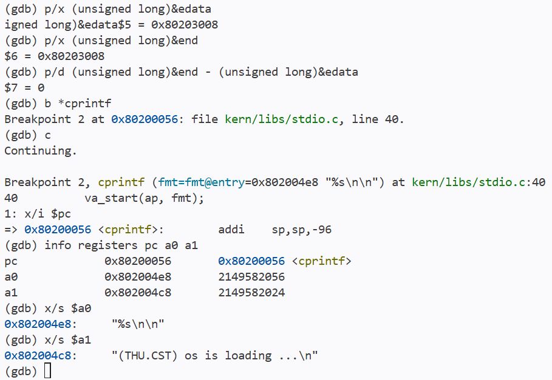
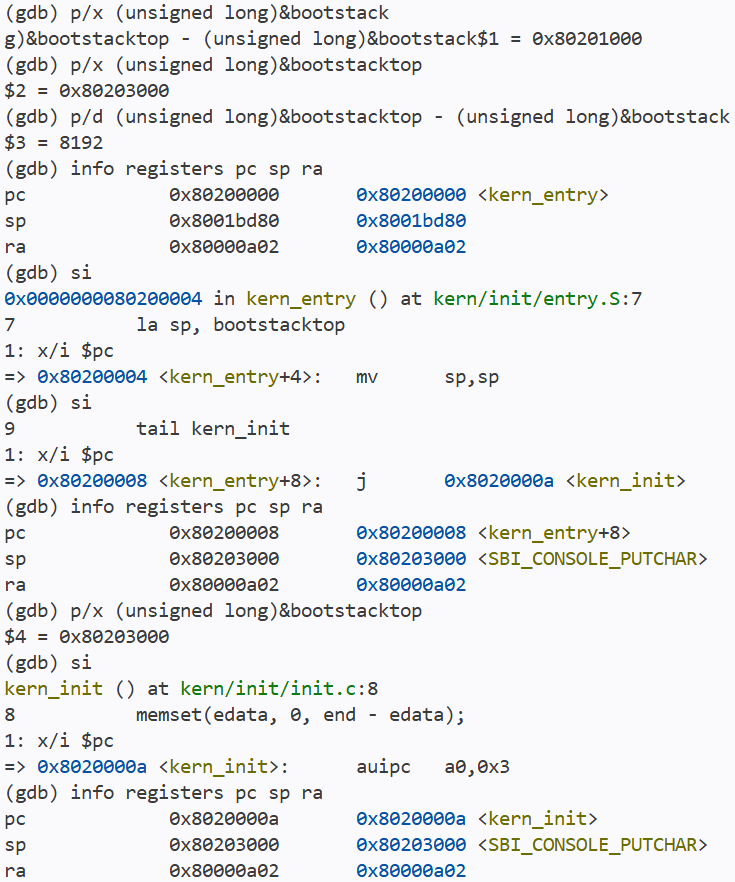
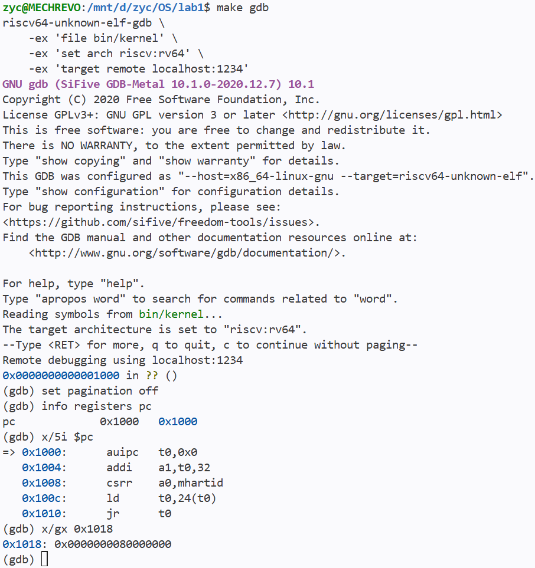
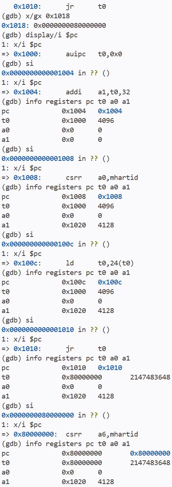
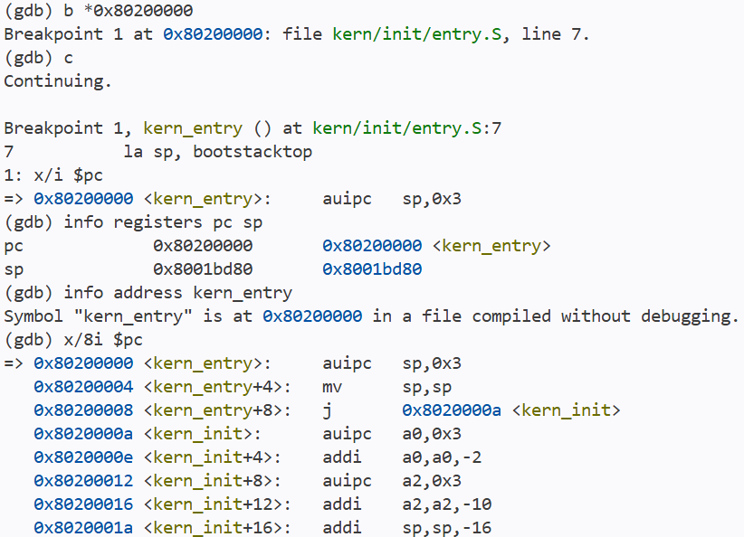
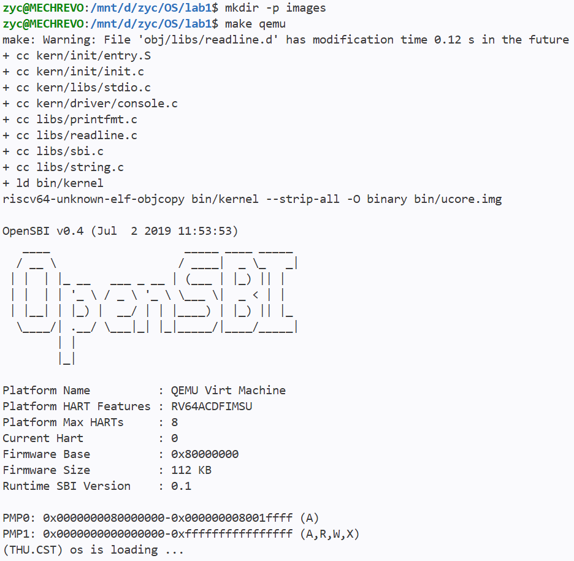

# 实验报告

## 实验基本信息

| 项目 | 内容 |
|------|------|
| **实验名称** | Lab 1: 比麻雀更小的麻雀（最小可执行内核） |
| **小组成员** | 2513333-张翌辰、2514195-郝春捷、2513191-陈大伟 |
| **完成日期** | 2026-10-10 |

### 小组分工

练习如何分工？

| 成员 | 负责的练习/模块 |
|------|----------------|
| 2513333-张翌辰 | [练习或模块名称] |
| 2514195-郝春捷 | [练习或模块名称] |
| 2513191-陈大伟 | [练习或模块名称] |

实验报告如何分工？

---

## 一、实验目的

<!-- 说明本次实验的主要目标和预期成果 -->

本实验的主要目的是：

1. 理解 QEMU RISC-V virt 平台从复位代码、OpenSBI 到最小
   内核的启动过程，以及各阶段的控制权交接。
2. 理解交叉编译、链接脚本、ELF 与原始内核镜像的关系，
   掌握内核入口、内存布局和启动栈的作用。
3. 使用 GDB 验证启动流程，并理解内核初始化与通过 SBI
   实现格式化输出的过程。

---

## 二、实验环境

编译与运行环境

| 项目 | 配置 |
|------|------|
| 运行环境 | Windows 上的 WSL2，Linux x86_64 |
| GNU Make | 4.3 |
| OpenSBI | 固件版本：v0.4 |
| 交叉编译器 | riscv64-unknown-elf-gcc 10.2.0 |
| 调试器 | riscv64-unknown-elf-gdb 10.1 |
| 模拟器 | qemu-system-riscv64 4.1.1 |
| 模拟平台 | RISC-V 64 位 virt 平台 |

你们使用的 AI 工具

| 成员 | AI 编程工具 | 底层模型 | 备注 |
|------|------------|---------|------|
| 2513333-张翌辰 | Claude Code | DeepSeek-V4-Flash | Effort(High) |
| 2514195-郝春捷 | | | |
| 2513191-陈大伟 | | | |

**说明：**
- **AI 编程工具**：指具体使用的终端工具、编辑器插件、桌面应用或浏览器界面
- **底层模型**：指该工具使用的大语言模型及版本

---

## 三、实验整体逻辑分析

### 3.1 本章节的逻辑主线

本实验围绕“如何让一个最小内核开始执行并输出信息”展开。

构建阶段，RISC-V 交叉编译器生成目标文件，链接器按照
kernel.ld 确定入口与各段布局，生成 ELF 文件，再由 objcopy
生成原始二进制镜像。

运行阶段，QEMU 在 CPU 开始执行前将固件和内核镜像加载到
内存。CPU 从 0x1000 的复位代码开始执行，进入 0x80000000
处的 OpenSBI。固件初始化后将控制权交给 0x80200000 处的
kern_entry；入口汇编设置启动栈，再转入 kern_init。
C 初始化函数处理清零区域、打印启动消息，最后进入无限循环。

### 3.2 各功能之间的依赖关系

1. 构建与布局：先确定代码、数据和入口地址，使镜像能够与
   QEMU 的加载位置正确配合。
2. 入口与启动栈：在进入 C 函数前设置有效的 sp，为函数调用、
   局部数据和寄存器保存提供空间。
3. C 初始化：通过链接器提供的边界符号处理零初始化区域，
   建立所需的初始状态。
4. 输出功能：从 SBI 字符服务逐层封装到格式化输出，使内核
   能够打印启动消息。
5. 调试验证：通过复位单步、入口断点和寄存器检查，将源码
   中的启动逻辑与实际执行过程对应起来。

本实验使用已提供的内核代码，上述顺序描述功能依赖与学习
过程，不代表本组重新实现了这些模块。

---

## 四、实验内容与实现

<!-- 
说明：本部分按照 exercises 文档中的练习顺序组织
每个功能模块或者练习中可能包含多项任务，请根据实际情况调整
-->

### 核心模块分析

#### 构建与链接布局

Makefile 使用 RISC-V 交叉编译器将源码编译为目标文件，
再通过 `ld -T tools/kernel.ld` 链接生成 `bin/kernel`。
随后使用 `objcopy --strip-all -O binary` 生成原始镜像
`bin/ucore.img`。

通过 readelf 检查，bin/kernel 是 ELF64、小端、RISC-V
可执行文件，入口地址为 `0x80200000`，与 GDB 观察一致。

本次构建的主要段布局如下：

| 段 | 起始地址 | 大小 | 作用 |
|----|----------|------|------|
| .text | 0x80200000 | 0x4c8，1224 字节 | 内核机器指令 |
| .rodata | 0x802004c8 | 0x270，624 字节 | 字符串等只读数据 |
| .data | 0x80201000 | 0x2000，8192 字节 | 本次主要用于启动栈 |
| .sdata | 0x80203000 | 0x8，8 字节 | 小型可写全局数据 |

链接脚本中的 `ENTRY(kern_entry)` 指定 ELF 入口，
`BASE_ADDRESS` 和地址计数器确定各段布局。
`ALIGN(0x1000)` 将数据区域按 4096 字节边界对齐。

edata 和 end 是链接器提供的边界符号。本次没有 .bss
条目，两者均为 `0x80203008`，因此初始化清零范围为空。

bin/kernel 保留符号表和调试信息，供 GDB 使用；
bin/ucore.img 是原始二进制镜像，由 QEMU 的 loader
加载到 `0x80200000`。链接地址与加载地址相配合，
使 CPU 能从正确的内核入口开始执行。

#### C 入口初始化与输出

`kern_init()` 首先通过链接器定义的 edata、end 符号确定
清零区域，调用 `memset(edata, 0, end - edata)`，为需要
初始化为零的数据建立初始状态。

GDB 查询得到，本次构建中 edata 和 end 均为
`0x80203008`，清零长度为 0，即本次该区域为空。

随后调用 `cprintf("%s\n\n", message)` 输出启动消息。
在 cprintf 入口设置断点，观察到 a0 指向格式串
`"%s\n\n"`，a1 指向消息
`"(THU.CST) os is loading ...\n"`，与源码一致。

输出后，kern_init 进入无限循环，不返回入口汇编。



#### 格式化输出与 SBI 接口

源码中的输出调用关系为：

cprintf → vcprintf → vprintfmt → cputch → cons_putc
→ sbi_console_putchar → sbi_call → ecall → OpenSBI。

cprintf 使用 va_list 处理可变参数，vcprintf 将格式串、
参数和字符输出回调交给 vprintfmt。vprintfmt 解析 `%s`
等格式，将字符串逐字符交给回调 cputch；cputch 调用
cons_putc 输出字符，并维护输出计数。

sbi_console_putchar 调用 sbi_call，将字符输出服务编号 1
放入 a7，将字符参数放入 a0，再执行 ecall。

内核运行在 S 模式，OpenSBI 运行在 M 模式。普通函数调用
不能提升特权级，因此内核通过 ecall 触发异常，进入
OpenSBI 请求服务。OpenSBI 负责底层字符输出，格式串的解析
由内核中的 vprintfmt 完成。

### 练习 1：理解内核启动中的程序入口操作

`la sp, bootstacktop` 将启动栈顶地址加载到栈指针寄存器 sp。
栈空间由 entry.S 中的 `.space KSTACKSIZE` 静态预留，
该指令负责设置栈指针，不负责动态分配内存。

本实验启动栈占两页，共 8192 字节。栈向低地址增长，因此初始
sp 设置为高地址边界 bootstacktop，为后续 C 函数的局部数据、
寄存器保存和函数调用提供栈空间。

GDB 查询得到 bootstack 为 `0x80201000`，bootstacktop 为
`0x80203000`。执行 la 对应的两条机器指令后，sp 变为
`0x80203000`，与栈顶一致。

`tail kern_init` 以尾调用方式将控制流转入 C 初始化函数，
不为 kern_entry 建立新的返回地址。本次构建将其优化为
直接跳转到 kern_init 的 j 指令。

单步执行后，PC 从 `0x80200008` 变为 `0x8020000a`，
ra 保持 `0x80000a02` 不变。这符合 kern_init 不返回、
最终进入无限循环的设计。



### 练习 2：使用 GDB 验证启动流程

#### 加电复位位置与初始指令

在两个终端分别执行 `make debug` 和 `make gdb`。
连接后执行以下命令：

```gdb
set pagination off
info registers pc
x/5i $pc
x/gx 0x1018
```

观察到 CPU 的初始 PC 为 `0x1000`。
此处是 QEMU virt 平台的 MROM 复位代码。

根据反汇编，最初五条指令的作用如下：

| 地址 | 指令 | 作用 |
|------|------|------|
| 0x1000 | auipc t0, 0 | 将当前 PC 地址放入 t0 |
| 0x1004 | addi a1, t0, 32 | 设置设备树地址参数 a1 |
| 0x1008 | csrr a0, mhartid | 将当前 hart 编号放入 a0 |
| 0x100c | ld t0, 24(t0) | 从 0x1018 读取固件入口地址 |
| 0x1010 | jr t0 | 跳转到 t0 指定的固件入口 |

检查内存发现，`0x1018` 存放的入口地址为 `0x80000000`。



#### 单步验证进入 OpenSBI

使用 `si` 逐条执行五条复位指令，并在每次执行后通过
`info registers pc t0 a0 a1` 检查寄存器。

观察到：第一条指令将 `0x1000` 放入 t0；第二条指令将设备树
地址 `0x1020` 放入 a1；第三条指令读取 hart 编号，本次为 0；
第四条指令从 `0x1018` 读取固件入口，使 t0 变为 `0x80000000`；
第五条 `jr t0` 执行后，PC 变为 `0x80000000`。

这验证了 MROM 复位代码向 OpenSBI 固件移交控制权的过程。



#### 验证进入内核入口

在 OpenSBI 入口处设置断点 `b *0x80200000`，随后执行 `c`。
程序命中断点，停在 `kern_entry` 的第一条指令处。

通过寄存器和符号检查，确认 PC 与 `kern_entry` 的地址均为
`0x80200000`，验证了 OpenSBI 向内核移交控制权的过程。

此时入口指令尚未执行，sp 为 `0x8001bd80`。
反汇编显示，`la sp, bootstacktop` 对应 `auipc` 和 `mv` 两条
机器指令；`tail kern_init` 在本次构建中被优化为直接跳转
到 `0x8020000a` 的 `j` 指令。



继续单步执行内核入口，确认 sp 被设置为 bootstacktop，
随后 PC 进入 kern_init，完成从复位代码、OpenSBI 到 C 初始化
函数的启动跟踪。栈与尾调用的具体观察见练习 1。

**负责人：** [2513333-张翌辰]

---

### Challenge：[Challenge标题]

**负责人：** [学号-姓名]

[按照Challenge的具体要求进行解答]

---

## 五、测试与验证

<!-- 根据该实验的具体情况，提供完整的测试运行截图，应包含：
- 编译及运行成功的输出（make qemu），可能有多个
-->

### 5.1 编译与启动验证

在 WSL2 的 lab1 目录执行：

```bash
make qemu
```

源码编译、链接成功，生成 ELF 文件 `bin/kernel`，随后通过
`objcopy` 生成原始二进制镜像 `bin/ucore.img`。

QEMU 启动 OpenSBI v0.4，随后内核输出：

```text
(THU.CST) os is loading ...
```

输出后内核进入 `kern_init()` 末尾的无限循环，符合预期，
说明最小内核能够成功启动并完成控制台输出。



---

## 六、实验总结与收获

### 对操作系统的理解

本实验中的主要知识点与 OS 原理对应如下：

| 实验内容 | 对应原理及联系 | 本实验的范围 |
|----------|----------------|--------------|
| 复位代码、OpenSBI、内核入口 | 系统引导与控制权交接，各阶段逐步建立运行条件 | 镜像由 QEMU 预加载，没有自行实现磁盘引导程序 |
| M 模式与 S 模式、ecall | 特权级与受控服务请求 | 验证的是内核请求固件服务，尚未运行用户进程 |
| 启动栈与 sp | 函数调用所需的执行环境 | 使用静态启动栈，尚未实现进程上下文切换 |
| 链接脚本与各段布局 | 程序代码和数据的地址安排 | 属于静态布局，尚未实现动态内存分配与页表管理 |
| BSS 初始化 | 为零初始化数据建立初始状态 | 本次清零范围为空，不能据此声称验证了非零数据被清零 |
| 格式化输出调用链 | 分层封装与接口抽象 | 内核解析格式串，底层字符输出依赖 OpenSBI |

OS 原理中重要但本实验尚未实现的内容包括：进程创建与调度、
虚拟内存和地址空间隔离、动态物理内存分配、完整中断处理、
同步互斥及文件系统。本实验首先建立能够启动和输出的最小
内核，为后续功能提供基础。

### AI 协作开发的经验

本次使用 AI 辅助阅读源码、安排 GDB 调试步骤和整理实验记录，
没有使用 AI 生成或修改内核功能代码。

对 AI 给出的解释，我们通过源码、寄存器、反汇编和 ELF 信息
进行核对。例如，实测 edata 与 end 相等，确认本次清零范围
为空；通过跳转前后 ra 不变，验证尾调用行为。

学习过程中，将“ecall 是唯一能跨越特权级的入口”的表述修正为：
本实验通过 ecall 请求 M 模式的 OpenSBI 服务，但特权级切换
还可以涉及中断、其他异常和异常返回指令。这说明应限定解释
的适用范围，并用实际证据核对结论。

---

